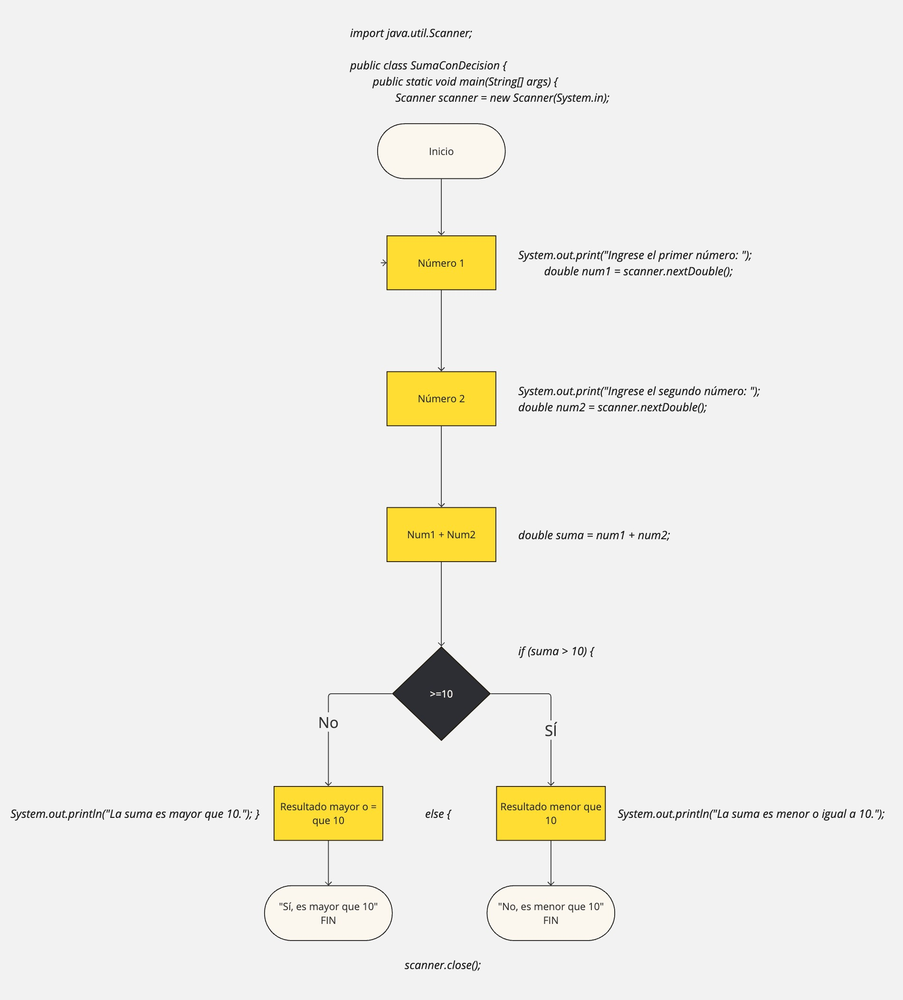
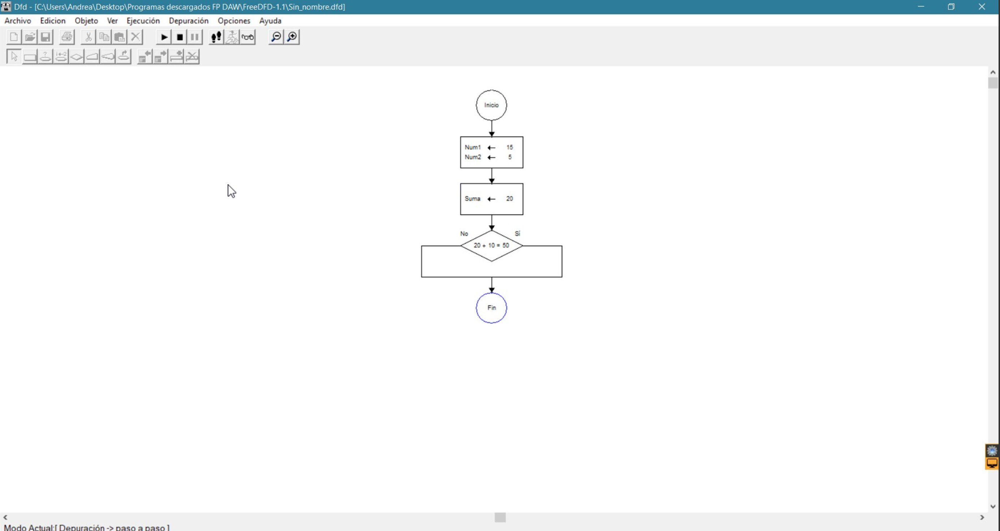

# Introducción a la Programación

La programación se basa en la **resolución de problemas**, y para lograrlo seguimos *tres fases principales*:

1. Análisis del problema: Comprender y definir claramente qué se quiere resolver.
2. Diseño o desarrollo de <abbr title="Secuencia ordenada de pasos, descrita sin ambigüedades, que conducen a la solución de un problema dado. Es decir, son como una RECETA.">algoritmos</abbr>: Crear posibles soluciones estructuradas y efectivas.
3. Implementación del algoritmo en el ordenador: Traducir la solución a un lenguaje que la máquina pueda ejecutar.


## Desarrollo de Algoritmos [2.]

En la segunda fase, el diseño del algoritmo, utilizamos diversas herramientas y enfoques que nos ayudan a estructurar nuestras soluciones. Estas son las principales:

### a. **Abstracción**
Descomponemos el problema en partes más pequeñas y manejables, reduciendo la complejidad.  
> "Divide y vencerás."

### b. **Encapsulación**
Ocultamos información al resto de elementos del sistema, buscamos la independecia de los componentes.  
> "La ignorancia te hará libre."

### c. **Modularidad**
Los módulos son independientes y cada uno tendrá su función. 
> "Sigue trabajando, aún cuando el otro esta en la enfermeria" 

## Algoritmos y programas

En el **programa** utiliza un <abbr title="lenguaje formal utilizado para escribir algoritmos y realizar operaciones lógicas (ej. JAVA, Python, C++, JavaScript)">lenguaje de programación</abbr> específico para **escribir los algortimos** y así convertirlos en **código ejecutable** que la computadora pueda entender, y finalmente, resolver el problema. 
Y por ello, el **algoritmo** es la secuencia de pasos lógicos para resolver el problema.

| PROGRAMA | ALGORITMO|
|----------|----------|
|LENGUAJE  |INSTRUCCIONES|
|JAVA, Python, C++, JavaScript|Independiente del lenguaje de programación |
|Usa el algoritmo para crear código que la máquina ejecute | Son las instrucciones que describen cómo resolver el problema, sin depender de un lenguaje específico |

Para diseñar los **algoritmos** usamos diferentes herramientas:
- Diagrama de flujo (Diagrama BPMN)   
- Pseudocódigo
- Tablas de decisión

## Paradigmas de la programación

Los **paradigmas de programación** son formas o enfoques que determinan cómo diseñamos y resolvemos los algoritmos. Cada paradigma establece un conjunto de principios y metodologías para abordar un problema y estructurar la solución.
> Los paradigmas son como las RUTAS de un mapa: diferentes caminos para llegar a un mismo punto. 

1. **Programación declarativa**: Nos centramos en *qué queremos solucionar*, no en cómo lo haremos. El sistema se encarga de determinar la mejor manera de alcanzar ese resultado, gestionando el lenguaje y todo lo relacionado con la implementación.
    > "Buscamos el qué queremos, no el cómo lograrlo."
    
    Los paradigmas que se encuentran dentro de este tipo de programación declarativa son: <abbr title="En este paradigma, el software se divide en funciones, y cada función realiza una única tarea. Todo el programa se construye mediante la composición de funciones. Un ejemplo de lenguaje que usa este paradigma es JavaScript o Scheme.">*programación FUNCIONAL*</abbr> y *programación LÓGICA*.
   
   - *Ejemplo 1:* <abbr title="Structured Query Language, lenguaje de consulta estructurado, es un lenguaje para computación, no para programación">**SQL**</abbr> es un lenguaje declarativo utilizado para gestionar bases de datos. Al consultar una base de datos con una sentencia SQL, simplemente se describe qué información se quiere, sin preocuparse por cómo se realiza la búsqueda internamente.
   
   - *Ejemplo 2:* <abbr title="Un framework basado en JavaScript">**Angular**</abbr> utiliza un enfoque declarativo para la creación de interfaces de usuario, describiendo el qué debe ocurrir, sin especificar el cómo.

```java
// Queremos un programa qué nos filtre números mayores a 10.
import java.util.ArrayList;  // Importa la clase para trabajar con listas dinámicas
import java.util.List;  // Importa la interfaz List que se usa para crear listas
import java.util.stream.Collectors;  // Importa las herramientas para trabajar con flujos de datos

public class DeclarativeExample {  // Empieza la clase llamada DeclarativeExample
    public static void main(String[] args) {  // Método principal que se ejecuta al inicio

        // Crea una lista vacía para guardar los números
        List<Integer> numbers = new ArrayList<>();
        numbers.add(5);  // Añade el número 5 a la lista
        numbers.add(15);  // Añade el número 15 a la lista
        numbers.add(3);   // Añade el número 3 a la lista
        numbers.add(20);  // Añade el número 20 a la lista
        
        // Usamos Streams para filtrar los números mayores a 10 (declarativo)
        List<Integer> filteredNumbers = numbers.stream()  // Convierte la lista en un "flujo" de datos
                                                .filter(number -> number > 10)  // Filtra los números mayores a 10
                                                .collect(Collectors.toList());  // Convierte el flujo filtrado nuevamente en una lista
        
        // Imprime los números filtrados
        System.out.println(filteredNumbers);  // Imprime la lista filtrada: [15, 20]
    }
}
```

2. **Programación imperativa**: Nos enfocamos en describir *cómo lograr el resultado*, indicando cada paso a seguir de forma **secuencial** (como una receta).
   > "Vamos paso por paso, como una receta. Primero levantas la mano, luego giras a la derecha, sigues a la izquierda, x2... ¡estás saludando!"

   Los paradigmas que se encuentran dentro de este tipo de programación imperativa son:
   - **Programación estructurada**: Conocida también como programación secuencial o de arriba hacia abajo. Se enfoca en dividir el problema en partes más pequeñas y ordenadas, ejecutando cada paso de manera secuencial.
     - *Ejemplo 1:* En lenguajes como **Java** o **C++**, describimos el orden específico de las operaciones que la computadora debe seguir para llegar al resultado.

   - **Programación orientada a objetos (POO)**: Organiza el código en "objetos", que son entidades con **características** (atributos) y **acciones** (métodos). Los objetos interactúan entre sí para resolver el problema de manera más modular.
     - *Ejemplo 2:* En **Python**, cuando usamos un ciclo `for` o `while` para recorrer elementos y aplicar transformaciones en cada paso. Python es un lenguaje **multiparadigma**, lo que significa que admite varios enfoques de programación.

```java
// Le damos al programa todos los pasos para que llegue a filtrar números mayores a 10.
import java.util.ArrayList;  // Importa la clase para trabajar con listas dinámicas
import java.util.List;  // Importa la interfaz List que se usa para crear listas

public class ImperativeExample {  // Empieza la clase llamada ImperativeExample
    public static void main(String[] args) {  // Método principal que se ejecuta al inicio

        // Crea una lista vacía para guardar los números
        List<Integer> numbers = new ArrayList<>();
        numbers.add(5);  // Añade el número 5 a la lista
        numbers.add(15);  // Añade el número 15 a la lista
        numbers.add(3);   // Añade el número 3 a la lista
        numbers.add(20);  // Añade el número 20 a la lista
        
        // Crea otra lista vacía donde se guardarán los números mayores que 10
        List<Integer> filteredNumbers = new ArrayList<>();
        
        // Recorre todos los números de la lista 'numbers'
        for (int number : numbers) {
            // Si el número es mayor que 10
            if (number > 10) {
                // Lo añade a la lista 'filteredNumbers'
                filteredNumbers.add(number);
            }
        }
        
        // Imprime los números filtrados en consola
        System.out.println(filteredNumbers);  // Imprime la lista filtrada: [15, 20]
    }
}
```
3. **Orientada a objetos [POO]**
Modula el código haciendolo más entendible y reutilizable. 
Separa al software en entidades llamadas objetos y estos tiene características y funciones. Luego esos objetos se relacionan. Así se usa en aplicaciones grandes. 


    - *Ejemplo1:* Java es multiparadigma, tiene diversos paradigmas & ES ORIENTADO A OBJETOS.


Funcional

Reactiva. 
Se observan flujos de datos que están yendo y viniendo y partir de esos flujos de datos constantes, estos se observan y cuando estos cambian se hace algo es decir reacción a los cambios según los flujos de datos.

